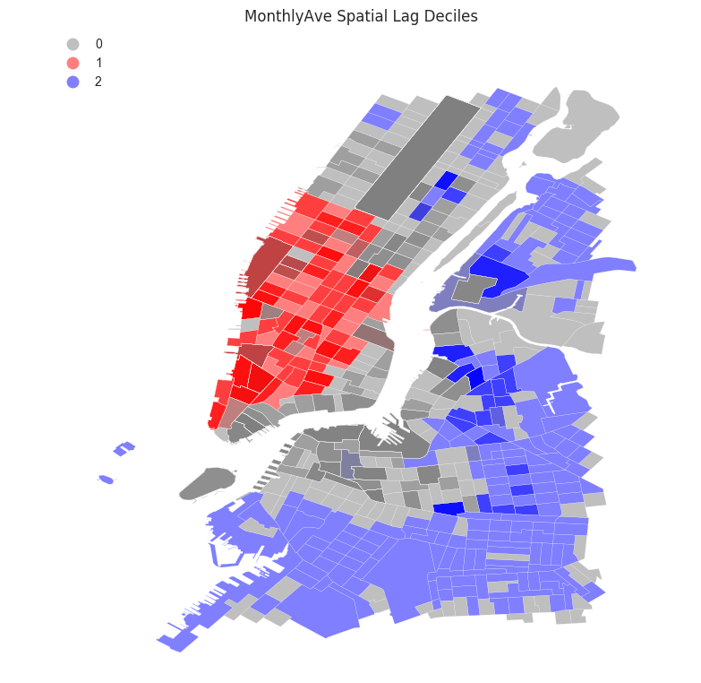
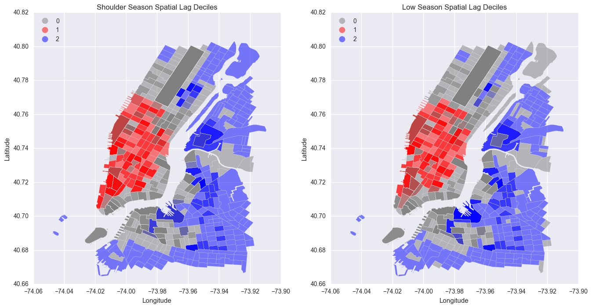

Assigmnet 1

This figure shows monthly rideship in terms of Local Spatial Autocorrelation, created by Dr. Sina Kashuk.
Assigment 2

These two figures show shouler season (summer season) and low (winter season) rideship in terms of Local Spatial Autocorrelation.
