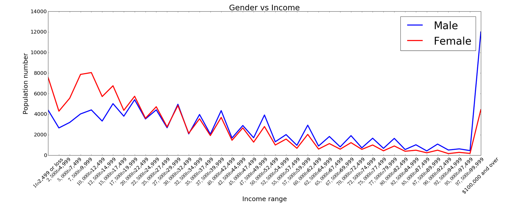

# PUI 2016 HW8 - Peer Review By Kelsey Reid

For the x axis I would suggest making the label more descriptive, specifically to add something to indicate the values are in dollars. Only the last tick label on the plot includes a dollar sign so viewed as a standalone plot it may not be immediately clear the type of money the data is talking about. It is interesting that at the range of $95,000 to $97,499 there is a sharp increase for both the number of male and female individuals falling within this grouping. Perhaps the data should be reviewed to see if this is an error or if not a caption referencing the spike may be helpful in helping viewers understand the drastic change. The plot is appropriate for the data chosen for the visualization. If additional data was to be added I would change the color of the female line from red to help avoid confusion for people who may have color blindness but with only two lines the difference can still be seen.
