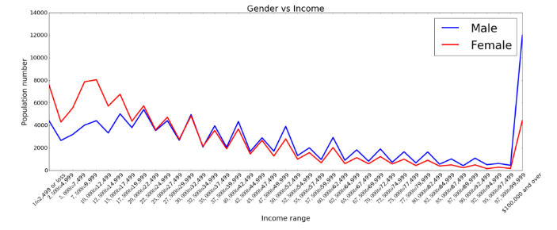

The graph illustrates the income gap between gender for each income group. From the graph, I can tell in which income groups, the income gap is wide and in which income groups, the income is narrow. However, the information presented in the graph may be misleading because the the data is absolute number. If there are more workers in one gender than the other, the income gap may be due to the difference between the genders' total numbers of workers. A more accurate way would be presenting the data in percentage (% of male/female in each income group)

In term of the graph's format, it is slightly difficult to identify the income group values on the x-axis. An alternative way is listing the x-tick values as [2,499; 4,999; 7,499; ...] 

Figure 1:

