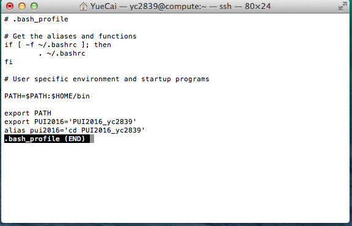
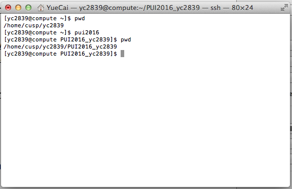

For this assignment:
I created a directory on compute called PUI2016_yc2839.
I created an environmental variable on my compute called PUI2016 (With XiaoMeng's help).  
I created an alias which takes me to the created dirctory (PUI2016_yc2839) on my compute (with XiaoMeng and Cheng Hou's help).  

